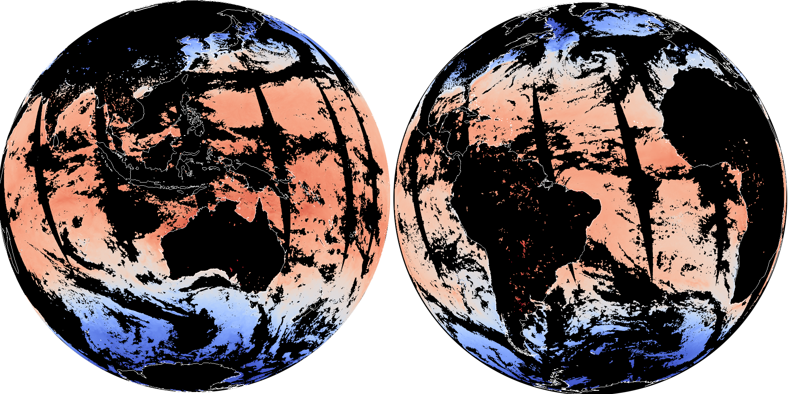
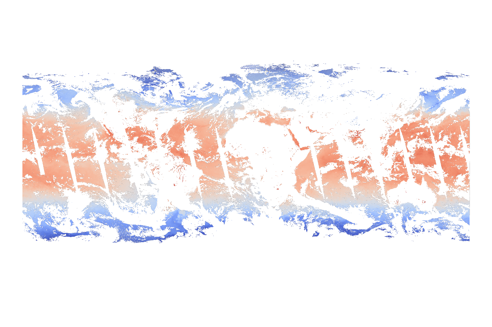
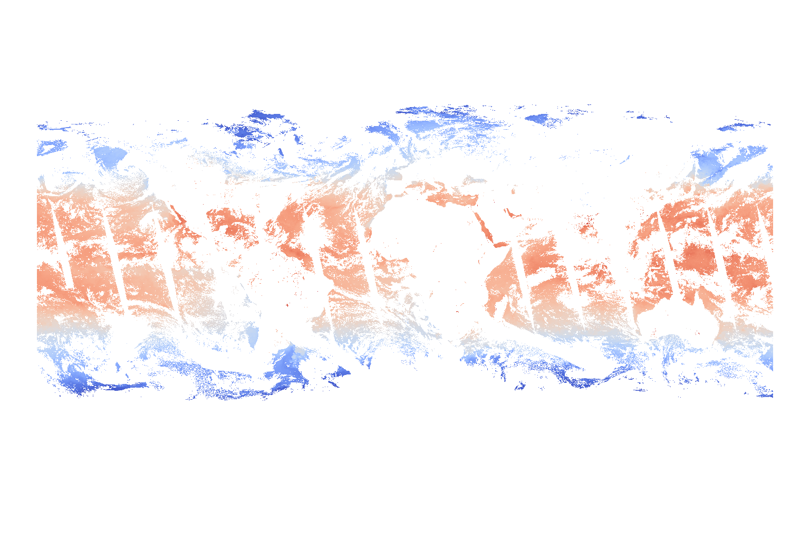

# Waterpark — HEALPix Data Hub
{ width="600" .img-center}
/// caption
Sea surface temperature seen by MODIS AQUA, remapped to HEALPix level 10.
///

Waterpark is a task force effort at DKRZ to convert climate and Earth observation
datasets onto a common [HEALPix](https://healpix.jpl.nasa.gov/) grid and serve
them as multi-resolution Zarr pyramids from S3 object storage.  The unified grid
enables efficient cross-dataset analysis, ML training pipelines, and interactive
visualisation without per-dataset regridding at access time.


### Currently available Datasets

| Dataset | Public Bucket | Data Access via |
|---------|---------------|-----------------|
| [CMIP6](https://wcrp-cmip.org/cmip-phase-6-cmip6)   | <https://eu-dkrz-3.dkrz.cloud/browser/cmip6> | `https://s3.eu-dkrz-3.dkrz.cloud/cimp6` |
| [DYAMOND](https://easy.gems.dkrz.de/DYAMOND/index.html)   | <https://eu-dkrz-3.dkrz.cloud/browser/dyamond> | `https://s3.eu-dkrz-3.dkrz.cloud/dyamond` |
| [EERIE](https://dataviewer.eerie-project.eu/home/eddy-rich)   | <https://eu-dkrz-3.dkrz.cloud/browser/eerie> | `https://s3.eu-dkrz-3.dkrz.cloud/eerie` |
| [ERA5](https://www.ecmwf.int/en/forecasts/dataset/ecmwf-reanalysis-v5)   | <https://eu-dkrz-3.dkrz.cloud/browser/era5> | `https://s3.eu-dkrz-3.dkrz.cloud/era5 `|
| [ICDC](https://www.cen.uni-hamburg.de/en/icdc)   | <https://eu-dkrz-3.dkrz.cloud/browser/icdc> | `https://s3.eu-dkrz-3.dkrz.cloud/icdc` |
| [ICON-DREAM](https://opendata.dwd.de/climate_environment/CDC/help/landing_pages/doi_landingpage_ICON-DREAM_v1-en.html)   | <https://eu-dkrz-3.dkrz.cloud/browser/icon-dream> | `https://s3.eu-dkrz-3.dkrz.cloud/icon-dream` |
| [nextGEMS](https://nextgems-h2020.eu)   | <https://eu-dkrz-3.dkrz.cloud/browser/nextgems> | `https://s3.eu-dkrz-3.dkrz.cloud/nextgems` |
| [ORCESTRA](https://orcestra-campaign.org/data.html)   | <https://eu-dkrz-3.dkrz.cloud/browser/orchestra> | `https://s3.eu-dkrz-3.dkrz.cloud/orchsestra`|

!!! note
    To browse the available datasets use the links in the Public Bucket columns,
    `https://eu-dkrz-3.dkrz.cloud/browser/<bucket>`. To access the
    data use the `https://s3.eu-dkrz-3.dkrz.cloud/<bucket>/<sub-dirs>/level_X.zarr`
    for example

    ```python
    import xarray as xr

    ds = xr.open_zarr("https://s3.eu-dkrz-3.dkrz.cloud/dyamond/icon-sap-5km/PT15M/level_9.zarr")
    ```

---

## Remapping methodology

All datasets *should* be remapped using **pre-computed, reusable ESMF weight files**
applied via sparse matrix multiplication.  Weight generation is a one-time cost
per source grid; application runs at near-memory-bandwidth speed using batched
cuSPARSE on GPU or batched SciPy on CPU.

| Variable type | Method | Rationale |
|---|---|---|
| Continuous fields (SST, temperature, wind, radiation, …) | **Conservative** | Area-weighted averaging preserves integrals and handles sub-pixel variability correctly. |
| Discrete / categorical fields (land-sea masks, land cover, soil type, …) | **Nearest neighbour** | Preserves class labels without creating non-physical intermediate values. |

The target HEALPix level for each dataset is chosen as the next level whose
characteristic pixel spacing is *coarser* than the source resolution, avoiding
oversampling.  Lower pyramid levels are derived by nested coarsening (reshape +
nanmean), not by repeated remapping.

??? info "Technical details"

    - Weight generation uses ESMF (`ESMF_RegridWeightGen` under MPI for large
      grids, ESMPy in-memory for moderate grids).
    - All HEALPix geometry is computed on a **perfect sphere**, consistent with
      ESMF's internal overlap calculation and with the geocentric coordinates
      used by climate models.
    - Weight application supports three backends selected automatically:
      **cuSPARSE / GPU** (via CuPy), **Numba** (fused CSR kernel), and
      **batched SciPy** (BLAS-accelerated sparse matmul).
    - The tooling is provided by the
      [`grid-doctor`](https://github.com/freva-org/grid-doctor) Python package.

---

??? info "Benchmark for conservative remapping of HP Level 10 on NVIDIA GH200"

    The example below outlines the full pipeline of conservative remapping
    on a 4x NVIDIA Grace Hopper 200 Superchip node
    (288 CPUs and 856 GB RAM, 4 GPUs 382 GB) using
    CuPy and ESMF with 64 openmpi ranks.
    The dataset that was regridded and uploaded on s3 was one year of
    MODIS-AQUA at roughly 2km resolution (HEALPix level 10).


    ```python

    from dask.diagnostics.progress import ProgressBar
    from getpass import getuser
    from pathlib import Path

    import grid_doctor as gd

    # --- 1. Open source data ---
    dset = gd.cached_open_dataset(
        Path("/pool/data/ICDC/ocean/modis_aqua_sst/DATA/daily/2025").rglob("*.nc"),
        chunks={"lat": -1},
    )

    # --- 2. Generate reusable weights (one-time) ---
    weights_dir = Path(
        "/scratch/{u[0]}/{u}/healpix-weights".format(u=getuser())
    )
    resolved_level = gd.resolution_to_healpix_level(
        gd.get_latlon_resolution(dset)
    )
    %time weights_file = gd.cached_weights(
        dset,
        level=resolved_level,
        cache_path=weights_dir,
        nproc=64,
        prefer_offline=True,
    )
    # Wall time: ~2 min 30 s (Grace CPUs, 64 MPI ranks)

    # --- 3. Build multi-resolution pyramid ---
    pyramid = gd.create_healpix_pyramid(
        dset,
        max_level=resolved_level,
        weights_path=weights_file,
        backend="cupy",
    )
    # --- 4. Verify ---
    with ProgressBar():
        hp = pyramid[resolved_level].isel(time=slice(0, 10)).load()
        # Wall time: ~13 s (Hopper GPU)

    # --- 5. Write to S3 ---
    s3_options = gd.get_s3_options(
        "https://s3.eu-dkrz-3.dkrz.cloud",
        Path("~/.s3-credentials.json").expanduser(),
    )
    %time gd.save_pyramid_to_s3(
        pyramid,
        "/icon-dream/healpix/icdc/modis/aqua",
        s3_options,
        mode="w",
    )
    # Wall time: ~1 h 25 min (Hopper GPU)
    ```

    The result can be inspected in
    [gridlook](https://gridlook.pages.dev/#https://s3.eu-dkrz-3.dkrz.cloud/icon-dream/healpix/icdc/modis/aqua/level_10.zarr),
    for comparison the original grid can be opened following this
    [link (no firefox)](https://gridlook.pages.dev/#https://s3.eu-dkrz-3.dkrz.cloud/icon-dream/healpix/icdc/modis/og.zarr) or below:

    <figure markdown="span">
        { width="600" }
        <figcaption>HEALPix: remapped to HEALPix level 10.</figcaption>
    </figure>

    <figure markdown="span">
        { width="600" }
        <figcaption>Original: regular lat-lon grid at about 2.6 km resolution.</figcaption>
    </figure>


## Datasets

### Observations & reanalysis

??? example "ICDC — Integrated Climate Data Center :material-progress-clock:{ .warning }"

    **Status:** :material-progress-clock:{ .warning } In Progress

    Satellite and in-situ derived climate data records curated by the
    [ICDC](https://www.cen.uni-hamburg.de/en/icdc) at Universität Hamburg.

    | Property | Value |
    |---|---|
    | Source resolution | varies |
    | HEALPix level | varies |
    | Temporal coverage | 2002 – present (daily) |
    | Variables | TBD |

    **S3 store:** [`icdc`](https://eu-dkrz-3.dkrz.cloud/browser/icdc)
    ??? quote "Example: icdc/healpix/atmosphere/IMERG/PT30M/level_9"
        ```python
            <xarray.Dataset> Size: 587GB
            Dimensions:                              (time: 11664, cell: 3145728)
            Coordinates:
              * time                                 (time) datetime64[ns] 93kB 2025-01-0...
              * cell                                 (cell) int64 25MB 0 1 ... 3145727
                crs                                  float64 8B ...
                latitude                             (cell) float64 25MB dask.array<chunksize=(98304,), meta=np.ndarray>
                longitude                            (cell) float64 25MB dask.array<chunksize=(98304,), meta=np.ndarray>
            Data variables:
                calibrated_precipitation             (time, cell) float32 147GB dask.array<chunksize=(1, 3145728), meta=np.ndarray>
                precipitation_qualityindex           (time, cell) float32 147GB dask.array<chunksize=(1, 3145728), meta=np.ndarray>
                precipitation_randomerror            (time, cell) float32 147GB dask.array<chunksize=(1, 3145728), meta=np.ndarray>
                probability_of_liquid_precipitation  (time, cell) float32 147GB dask.array<chunksize=(1, 3145728), meta=np.ndarray>
            Attributes: (12/33)
                Conventions:                CF-1.6
                title:                      GPM_3IMERGHH: NASA Global Precipitation Measu...
                summary:                    See https://disc.gsfc.nasa.gov/datasets/GPM_3...
                institution:                Producer: NASA Global Precipitation Measureme...
                creator_url:                https://gpm.nasa.gov/missions/GPM ; https://w...
                creator_name:               NASA Global Precipitation Measurement Mission...
                ...                         ...
                comment:                    This is a reduced data set. Not included (but...
                references:                 1) Tan, J., G. J. Huffman, D. T. Belvin, E. J...
                citation:                   Huffman, G.J., E.F. Stocker, D.T. Bolvin, E.J...
                healpix_nside:              512
                healpix_level:              9
                healpix_order:              nested

        ```

??? example "ERA5 — ECMWF Reanalysis v5 :material-check-circle:{ .success }"

    **Status:** :material-check-circle:{ .success } Available

    The [ERA5](https://www.ecmwf.int/en/forecasts/dataset/ecmwf-reanalysis-v5)
    global atmospheric reanalysis produced by ECMWF, covering 1940 to present
    on a 0.25° regular latitude-longitude grid (~31 km).  Provides hourly
    estimates of a large number of atmospheric, land, and oceanic climate
    variables.

    | Property | Value |
    |---|---|
    | Source resolution | 0.25° (~31 km) |
    | HEALPix level | 7 (nside = 128, ~27 arcmin) |
    | Temporal coverage | 1940 – present (hourly) |
    | Variables | T2m, Precip, |

    **S3 store:** [`era5/`](https://eu-dkrz-3.dkrz.cloud/browser/era5)
    **Notes:** time freq: cmor, level.zarr
    ??? quote "Example: era5/PT1H/level_7"
        ```python
            <xarray.Dataset> Size: 1TB
            Dimensions:    (time: 754752, cell: 196608)
            Coordinates:
              * time       (time) datetime64[ns] 6MB 1940-01-01 ... 2026-02-05T23:00:00
              * cell       (cell) int64 2MB 0 1 2 3 4 ... 196603 196604 196605 196606 196607
                crs        float64 8B ...
                latitude   (cell) float64 2MB dask.array<chunksize=(49152,), meta=np.ndarray>
                longitude  (cell) float64 2MB dask.array<chunksize=(49152,), meta=np.ndarray>
            Data variables:
                pr         (time, cell) float32 594GB dask.array<chunksize=(48, 196608), meta=np.ndarray>
                tas        (time, cell) float32 594GB dask.array<chunksize=(48, 196608), meta=np.ndarray>
            Attributes:
                CDI:            Climate Data Interface version 1.9.6 (http://mpimet.mpg.d...
                history:        Thu Mar 23 23:49:59 2023: cdo -s -z zip_9 mergetime /scra...
                institution:    European Centre for Medium-Range Weather Forecasts
                Conventions:    CF-1.6
                license:        Contains modified Copernicus Atmosphere Monitoring Servic...
                tracking_id:    d5b13485-16f3-5f65-8dfd-cf03615bcc01
                creation_date:  2023-03-23T23:27:08Z
                CDO:            Climate Data Operators version 1.9.6 (http://mpimet.mpg.d...
                healpix_nside:  128
                healpix_level:  7
                healpix_order:  nested

        ```


### Model intercomparisons & campaigns

??? example "EERIE — Eddy-Rich Earth System Models :material-check-circle:{ .success }"

    **Status:** :material-check-circle:{ .success } Available

    [EERIE](https://dataviewer.eerie-project.eu/home/eddy-rich) is an EU
    Horizon Europe project running coupled climate simulations at
    ocean-eddy-resolving resolution (< 10 km ocean, < 25 km atmosphere).  The
    project aims to understand the role of ocean mesoscale eddies in the climate
    system and provide high-fidelity projections.

    | Property | Value |
    |---|---|
    | Source resolution | ~5 km (model-dependent) |
    | HEALPix level | 9 |
    | Models | TBD |

    **S3 store:** [`eerie/`](https://eu-dkrz-3.dkrz.cloud/browser/eerie)
    **Notes:** Pseudo directory for experiments. More metadata
    ??? quote "Example eerie/eerie-hist-1950-v20240618_P1M_mean_9.zarr"
        ```python
        <xarray.Dataset> Size: 20GB
        Dimensions:  (time: 780, cell: 3145728, crs: 1)
        Coordinates:
          * time     (time) datetime64[ns] 6kB 1950-01-31T23:59:59 ... 2014-12-31T23:...
          * crs      (crs) float32 4B 0.0
        Dimensions without coordinates: cell
        Data variables:
            pr       (time, cell) float32 10GB dask.array<chunksize=(12, 262144), meta=np.ndarray>
            ts       (time, cell) float32 10GB dask.array<chunksize=(12, 262144), meta=np.ndarray>
        ```


??? example "DYAMOND — DYnamics of the Atmospheric general circulation Modeled On Non-hydrostatic Domains :material-check-circle:{ .success }"

    **Status:** :material-check-circle:{ .success } Available

    [DYAMOND](https://easy.gems.dkrz.de/DYAMOND/index.html) is a
    model intercomparison of global storm-resolving simulations at
    2.5–5 km resolution.  Includes both summer (2016) and winter (2020)
    experiment phases with output from ICON, IFS, NICAM, MPAS, GEOS,
    SAM, SCREAM, SHiELD, and UM.

    | Property | Value |
    |---|---|
    | Source resolution | 2.5–5 km |
    | HEALPix level | 10–11 |
    | Temporal coverage | 40-day windows (summer 2016, winter 2020) |

    **S3 store:** [`dyamond/`](https://eu-dkrz-3.dkrz.cloud/browser/dyamond)
    ??? quote "Example dyamond/icon-sap-5km/PT15M/level_10.zarr"
        ```python
            <xarray.Dataset> Size: 399GB
            Dimensions:    (time: 3961, cell: 12582912)
            Coordinates:
              * time       (time) datetime64[ns] 32kB 2020-01-20 ... 2020-03-01T06:00:00
              * cell       (cell) int64 101MB 0 1 2 3 ... 12582909 12582910 12582911
                crs        float64 8B ...
                latitude   (cell) float64 101MB dask.array<chunksize=(4194304,), meta=np.ndarray>
                longitude  (cell) float64 101MB dask.array<chunksize=(4194304,), meta=np.ndarray>
            Data variables:
                pr         (time, cell) float32 199GB dask.array<chunksize=(1, 4194304), meta=np.ndarray>
                tas        (time, cell) float32 199GB dask.array<chunksize=(1, 4194304), meta=np.ndarray>
            Attributes: (12/14)
                CDI:                       Climate Data Interface version 2.0.0rc2 (https...
                number_of_grid_used:       15
                grid_file_uri:             http://icon-downloads.mpimet.mpg.de/grids/publ...
                uuidOfHGrid:               0f1e7d66-637e-11e8-913b-51232bb4d8f9
                source:                    git@gitlab.dkrz.de:icon/icon-aes.git@6b5726d38...
                institution:               Max Planck Institute for Meteorology
                ...                        ...
                references:                see MPIM/DWD publications
                CDO:                       Climate Data Operators version 2.0.0rc2 (https...
                cdo_openmp_thread_number:  4
                healpix_nside:             1024
                healpix_level:             10
                healpix_order:             nested
        ```

??? example "nextGEMS — next Generation Earth Modelling Systems :material-check-circle:{ .success }"

    **Status:** :material-check-circle:{ .success } Available

    [nextGEMS](https://nextgems-h2020.eu/) is an EU Horizon 2020 project
    developing km-scale coupled Earth system models.  Multi-decadal
    simulations with ICON and IFS-FESOM at ocean-eddy-permitting
    resolution, providing a testbed for next-generation climate
    projections.

    | Property | Value |
    |---|---|
    | Source resolution | ~5–10 km |
    | HEALPix level | 10 |
    | Models | ICON |

    **S3 store:** [`nextgems/`](https://eu-dkrz-3.dkrz.cloud/browser/nextgems)
    **Notes:*** Subfolder for time frequencies, more metadata
    ??? quote "Example nextgems/ngc4008_PT15M_10.zarr"
        ```python
            <xarray.Dataset> Size: 106TB
            Dimensions:  (time: 1051968, cell: 12582912)
            Dimensions without coordinates: time, cell
            Data variables:
                pr       (time, cell) float32 53TB dask.array<chunksize=(16, 262144), meta=np.ndarray>
                tas      (time, cell) float32 53TB dask.array<chunksize=(16, 262144), meta=np.ndarray>

        ```
??? example "ICON-DREAM — DWD Reanalysis :material-check-circle:{ .success }"

    **Status:** :material-check-circle:{ .success } Available

    ICON-DREAM is a regional and global reanalysis effort by the German
    Weather Service (DWD) using the ICON modelling framework.  It produces
    high-resolution atmospheric reanalysis fields on the native ICON
    triangular mesh.

    | Property | Value |
    |---|---|
    | Source grid | ICON unstructured (triangular) |
    | HEALPix level | 8 |

    **S3 store:** [`icon-dream/`](https://eu-dkrz-3.dkrz.cloud/browser/icon-dream)
    **Notes:*** Consistent places
    ??? quote "Example /icon-dream/healpix/icon-dream-global/hourly/level_8.zarr"
        ```python
            <xarray.Dataset> Size: 2TB
            Dimensions:    (time: 137169, cell: 786432)
            Coordinates:
              * time       (time) datetime64[ns] 1MB 2009-12-31T22:00:00 ... 2025-08-30T2...
              * cell       (cell) int64 6MB 0 1 2 3 4 ... 786427 786428 786429 786430 786431
                latitude   (cell) float64 6MB dask.array<chunksize=(786432,), meta=np.ndarray>
                longitude  (cell) float64 6MB dask.array<chunksize=(786432,), meta=np.ndarray>
            Data variables:
                t2m        (time, cell) float64 863GB dask.array<chunksize=(10, 786432), meta=np.ndarray>
                tp         (time, cell) float64 863GB dask.array<chunksize=(10, 786432), meta=np.ndarray>
            Attributes:
                Conventions:             CF-1.7
                GRIB_centre:             edzw
                GRIB_centreDescription:  Offenbach
                GRIB_edition:            2
                GRIB_subCentre:          255
                healpix_level:           8
                healpix_nside:           256
                healpix_order:           nested
                history:                 2026-03-27T08:35 GRIB to CDM+CF via cfgrib-0.9.1...
                institution:             Offenbach
        ```


??? example "ORCESTRA — Organised Convection and EarthCARE Studies over the Tropical Atlantic :material-check-circle:{ .success }"

    **Status:** :material-check-circle:{ .success } Available

    [ORCESTRA](https://orcestra-campaign.org/data.html) is a coordinated
    field campaign (2024) combining aircraft, ship, and satellite
    observations over the tropical Atlantic to study organised deep
    convection and validate EarthCARE retrievals.  Includes HALO, ATR-42,
    and METEOR observations alongside high-resolution ICON simulations.

    | Property | Value |
    |---|---|
    | Source resolution | Campaign-dependent |
    | HEALPix level | TBD |

    **S3 store:** [`orchestra/`](https://eu-dkrz-3.dkrz.cloud/browser/orchstra)
    **Notes:** More sub folders
    ??? quote "Example /orchestra/Basic_Halo_Measurement_and_Sensor_System_BAHAMAS_data.zarr"
        ```python
            <xarray.Dataset> Size: 5MB
            Dimensions:  (time: 55628)
            Coordinates:
              * time     (time) datetime64[ns] 445kB 2024-08-16T07:19:00 ... 2024-09-23T2...
                height   float64 8B ...
            Data variables:
                Dauer    (time) int64 445kB dask.array<chunksize=(55628,), meta=np.ndarray>
                DD       (time) int64 445kB dask.array<chunksize=(55628,), meta=np.ndarray>
                FF       (time) float64 445kB dask.array<chunksize=(55628,), meta=np.ndarray>
                Lat      (time) float64 445kB dask.array<chunksize=(55628,), meta=np.ndarray>
                Long     (time) float64 445kB dask.array<chunksize=(55628,), meta=np.ndarray>
                RH       (time) float64 445kB dask.array<chunksize=(55628,), meta=np.ndarray>
                RR_SRM   (time) float64 445kB dask.array<chunksize=(55628,), meta=np.ndarray>
                Tro1     (time) int64 445kB dask.array<chunksize=(55628,), meta=np.ndarray>
                Trs      (time) int64 445kB dask.array<chunksize=(55628,), meta=np.ndarray>
                TT       (time) float64 445kB dask.array<chunksize=(55628,), meta=np.ndarray>
                VVV      (time) int64 445kB dask.array<chunksize=(55628,), meta=np.ndarray>
            Attributes:
                creator_email:  Martin.Stelzner@dwd.de, daniel.klocke@mpimet.mpg.de
                creator_name:   Martin Stelzner, Daniel Klocke
                featureType:    trajectory
                history:        Converted to Zarr by Lukas Kluft (lukas.kluft@mpimet.mpg.de)
                keywords:       precipitation amount, precipitation gauge, precipitation ...
                license:        CC-BY-4.0
                platform:       RV METEOR
                project:        ORCESTRA, BOW-TIE
                summary:        The rain gauge has an upper and a lateral collecting surf...
                title:          Rain gauge measurements during METEOR cruise M203
        ```

??? example "CMIP6 — Coupled Model Intercomparison Project Phase 6 :material-check-circle:{ .success }"

    **Status:** :material-check-circle:{ .success } Available

    [CMIP6](https://wcrp-cmip.org/cmip-phase-6-cmip6/) is the latest
    phase of the international model intercomparison providing the
    scientific basis for IPCC assessment reports.  Dozens of climate
    models at resolutions from ~25 km to ~250 km, covering historical
    simulations, future projections, and targeted experiments.

    | Property | Value |
    |---|---|
    | Source resolution | ~25–250 km (model-dependent) |
    | HEALPix level | 5 - 6 |
    **S3 store:** [`orchestra/`](https://eu-dkrz-3.dkrz.cloud/browser/orchstra)
    ??? quote "Example cmip6/healpix/cmip6/historical-r1i1p1f1/noresm2-mm/PT6H/level_5.zarr"
        ```python
            <xarray.Dataset> Size: 19GB
            Dimensions:    (time: 94900, lat: 192, bnds: 2, lon: 288, cell: 12288)
            Coordinates:
              * time       (time) object 759kB 1950-01-01 03:00:00 ... 2014-12-31 21:00:00
              * lat        (lat) float64 2kB -90.0 -89.06 -88.12 -87.17 ... 88.12 89.06 90.0
              * lon        (lon) float64 2kB 0.0 1.25 2.5 3.75 ... 355.0 356.2 357.5 358.8
              * cell       (cell) int64 98kB 0 1 2 3 4 5 ... 12283 12284 12285 12286 12287
                crs        float64 8B ...
                height     float64 8B ...
                latitude   (cell) float64 98kB dask.array<chunksize=(12288,), meta=np.ndarray>
                longitude  (cell) float64 98kB dask.array<chunksize=(12288,), meta=np.ndarray>
            Dimensions without coordinates: bnds
            Data variables:
                lat_bnds   (time, lat, bnds) float64 292MB dask.array<chunksize=(14600, 192, 2), meta=np.ndarray>
                lon_bnds   (time, lon, bnds) float64 437MB dask.array<chunksize=(14600, 288, 2), meta=np.ndarray>
                pr         (time, cell) float64 9GB dask.array<chunksize=(14600, 12288), meta=np.ndarray>
                tas        (time, cell) float64 9GB dask.array<chunksize=(14600, 12288), meta=np.ndarray>
                time_bnds  (time, bnds) object 2MB dask.array<chunksize=(1, 2), meta=np.ndarray>
            Attributes: (12/54)
                Conventions:               CF-1.7 CMIP-6.2
                activity_id:               CMIP
                branch_method:             Hybrid-restart from year 1200-01-01 of piControl
                branch_time:               0.0
                branch_time_in_child:      0.0
                branch_time_in_parent:     438000.0
                ...                        ...
                table_id:                  6hrPlev
                table_info:                Creation Date:(24 July 2019) MD5:0bb394a356ef9...
                title:                     NorESM2-MM output prepared for CMIP6
                tracking_id:               hdl:21.14100/19ec4c56-4a33-4abb-a992-efe6324676bd
                variable_id:               pr
                variant_label:             r1i1p1f
        ```


---

## Open decisions

!!! question "Can we define an appropriate naming convention?"

    Suggestion: `<bucket>/healpix/<experiment-compaign>/<model>/<freq>/level_X.zarr"`

    Naming conventions can be quite different for different datasets, but we
    can still aim at having a number **four** directory levels. If those
    *four* levels don't guarantee unique paths the directory names themselves
    can be adjusted to from uniq name patterns such as:

    ```bash
    <bucket>/healpix/<product>/<instrument-level>/<freq>/level_X.zarr
    <bucket>/healpix/<product-experiment>/<model-ensemble>/<freq>/level_X.zarr
    ```

    The output time frequency `freq` should follow ISO 8601 standard.

!!! question "Where to store cached weight files?"


    Weight files are reusable across runs for the same source grid and
    target level. The weight files with their grid signature should be stored
    at the following location:

    ```console
    ls /work/ks1387/healpix-weights

    weights_0ba7e6dca9ba1ae9.nc  weights_3051722bc32a01e5.nc  weights_46fdfc6feb8ea520.nc  weights_d9c2730b22295f4a.nc
    weights_2aff1785f62b0254.nc  weights_3a28f272e1fb6024.nc  weights_901fbfc4a3ce2458.nc
    ```

    To make sure that the weight files are getting reproducible and reusable
    stored use `cache_path=/work/ks1387/healpix-weights` weights generation.

!!! question "Zarr format: v2 or v3?"

    Some clients  (gdal,  zarrita) still require Zarr v2.
    Zarr v3 is the future standard but ecosystem support is still
    catching up.

    **Current decision:** Write Zarr v2 with consolidated metadata
    until gridlook supports v3.

---

## Roadmap

### Completed

- [x] Conservative remapping pipeline (`grid-doctor`) with GPU acceleration
- [x] 1st round of Datasets uploaded


### Next steps

- [ ] Operationalise the remapping pipeline (reproducible batch jobs)
- [ ] Set up shared weight-file cache on Lustre
- [ ] Automatic tape archival and retrieval of Zarr stores
- [ ] STAC catalogue integration for data discoverability
- [ ] Freva databrowser registration
- [ ] Documentation of the full process and methodology
