# ERA5-Land converter call graph

This document maps the commands dispatched by `converter.py` to the local
functions that do the work.  It deliberately groups standard-library, xarray,
zarr, and `grid_doctor` calls under their local wrapper, so the graph remains
useful as a code-navigation guide.

## How to read this document

The first five diagrams are **orientation views**.  They are not separate
executions and they intentionally omit repeated detail: each gives one useful
slice of the overall system.  The **Detailed command graphs** section starts
at [Fetch](#fetch) and expands every command path.

| Color | Module that owns the function |
| --- | --- |
| &nbsp; Gray `#e5e7eb` | `converter.py`: command parsing and orchestration. |
| &nbsp; Amber `#fef3c7` | `helpers/file_fetcher.py`: request configuration and source-file resolution. |
| &nbsp; Gold `#fde68a` | `helpers/formatter.py`: frequency, level, and destination formatting. |
| &nbsp; Red `#fee2e2` | `helpers/cleanup.py`: truncation and deletion. |
| &nbsp; Blue `#dbeafe` | `helpers/mapper.py`: remapping, coarsening, and zoom-level writes. |
| &nbsp; Violet `#ede9fe` | `helpers/datasets.py`: opening, normalising, and merging datasets. |
| &nbsp; Orange `#ffedd5` | `helpers/special.py`: special (`fx`) variables. |
| &nbsp; Green `#dcfce7` | `helpers/zarr_publisher.py`: Zarr publication, metadata sync, and source-store merge. |
| &nbsp; Pink `#fce7f3` | `cli/reflow_workflow.py`: parallel reflow planning and workers. |
| &nbsp; Cyan `#cffafe` | External `grid_doctor` calls. |
| &nbsp; Slate `#cbd5e1` | `cli.arguments.py`, `helpers.metadata.py`, and `helpers.grib.py`: small supporting modules. |

## Command entry points

This is the top-level dispatcher.  It answers: “which command starts which
major workflow?”, without showing their internal helper calls.

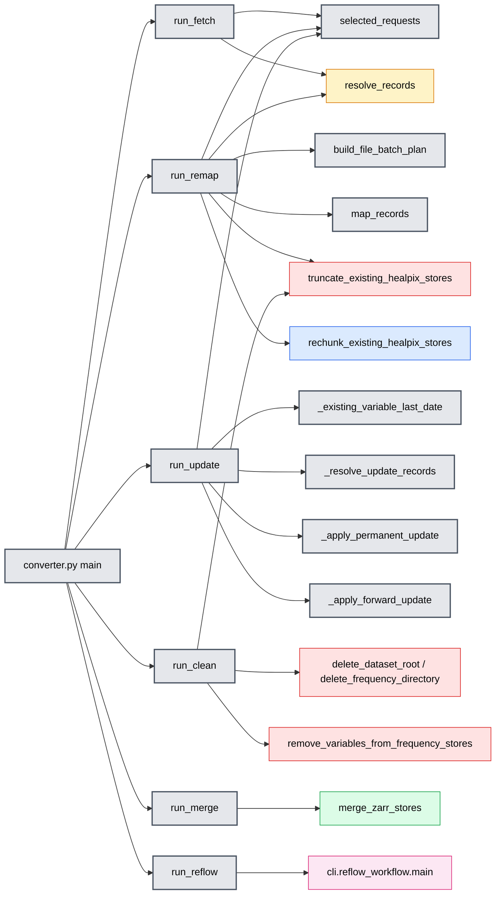

`run_reflow` is not another mapper implementation.  It delegates to the
workflow module, whose workers ultimately call the same `map_grib_to_healpix`
function used by normal remapping.

## Request and source resolution

This is the common input-preparation path.  `fetch`, `remap`, `update`, and
reflow planning all use it to turn selected variables and source files into
resolved records.

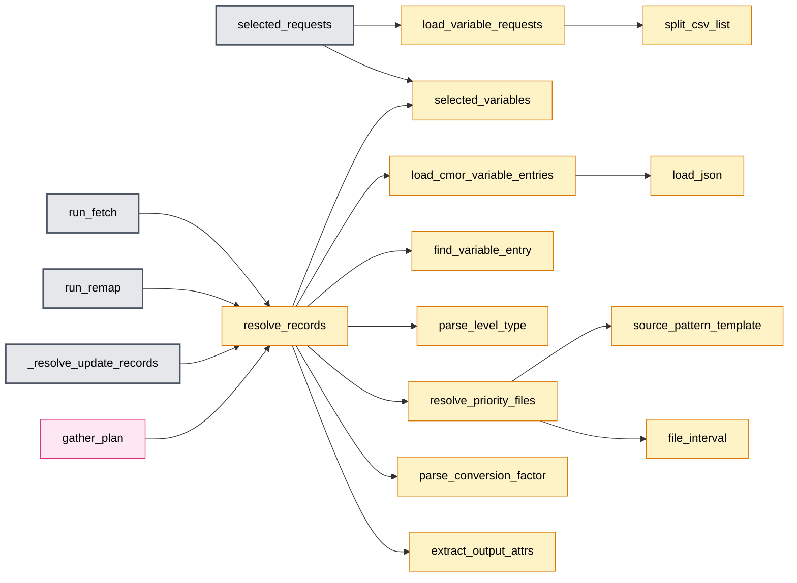

## Shared remapping spine

This is only the transformation portion after a command has records to map.
It is shared by ordinary remap, the remapping part of update, and reflow
workers; it does not show update-specific date selection or cleanup.

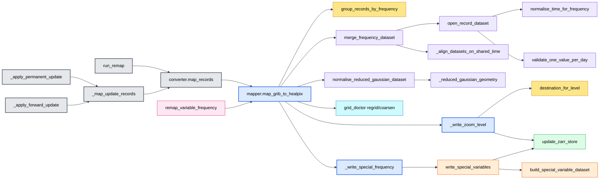

`map_grib_to_healpix` is the central transformation boundary.  It combines
resolved GRIB records, normalises their geometry and time axis, regrids or
coarsens them, then publishes each zoom level.  Special (`fx`) variables take
the `write_special_variables` branch instead of the ordinary regridding path.

## Update, cleanup, and merge paths

This view shows the work that is *not* repeated in the shared remapping spine.
For `run_update`, `_existing_variable_last_date` determines the already
published boundary and `_select_permanent_records` chooses the appropriate
source records.  Both update branches then enter `_map_update_records`, which
continues through `map_records` in the **Shared remapping spine** above.
`run_clean` is independent destructive-store maintenance, while `run_merge`
combines worker Zarr stores; they share this diagram only because both are
short storage-management paths.

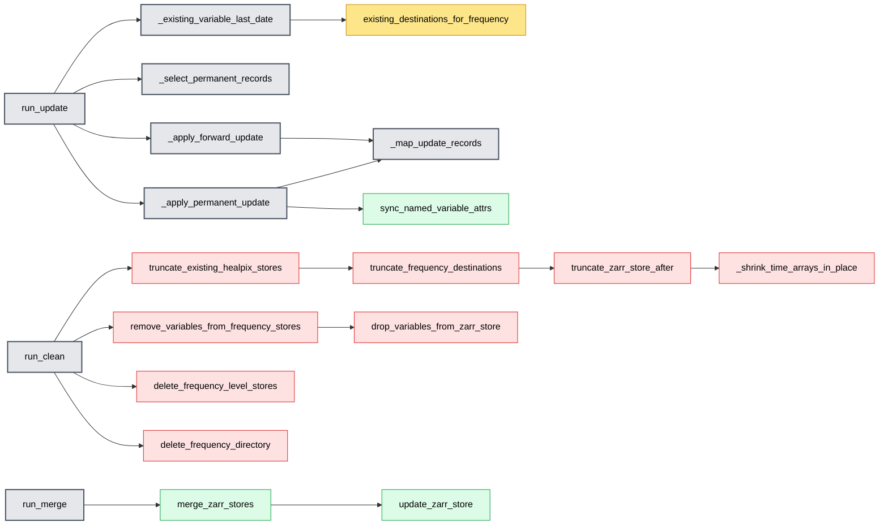

## Reflow workflow

Reflow is the parallel orchestration alternative to direct remap: it first
creates a work plan, maps each work item in a worker, then merges worker output
and writes special variables during finalisation.

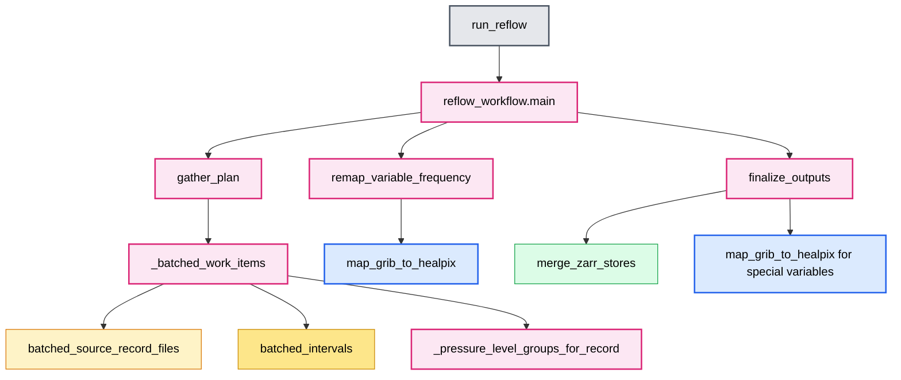

## Detailed command graphs

The remaining diagrams expand each command individually.  They repeat shared
functions by design, so a reader can follow one command without jumping back
to another diagram.  The same color legend applies to every diagram.

## Fetch

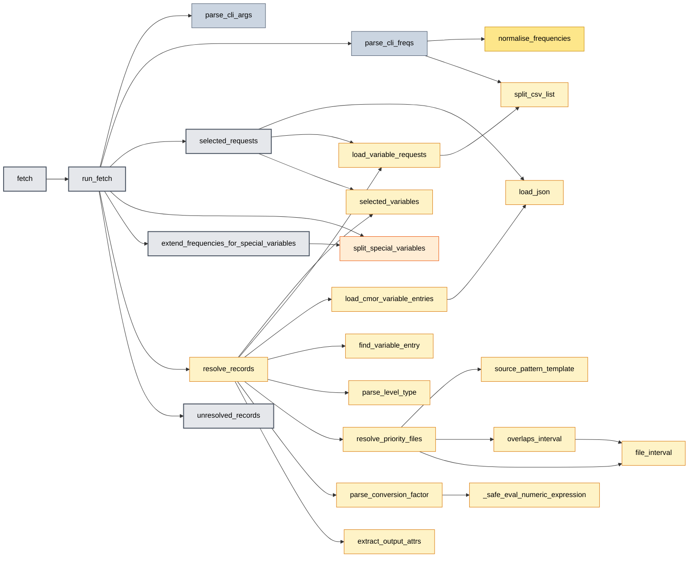

## Remap

```mermaid
flowchart LR
    remap[remap] --> run_remap
    run_remap --> parse_cli_args
    run_remap --> parse_cli_freqs
    run_remap --> parse_interval
    run_remap --> parse_truncate_after
    run_remap --> parse_coarsen_levels
    run_remap --> selected_requests
    run_remap --> split_special_variables
    run_remap --> extend_frequencies_for_special_variables
    run_remap --> validate_remap_args
    run_remap --> batch_file_child_state
    run_remap --> dataset_output_root
    run_remap --> truncate_existing_healpix_stores
    truncate_existing_healpix_stores --> truncate_frequency_destinations
    truncate_existing_healpix_stores --> existing_level_destinations
    existing_level_destinations --> existing_destinations_for_frequency
    truncate_existing_healpix_stores --> truncate_zarr_store_after
    truncate_zarr_store_after --> _shrink_time_arrays_in_place
    _shrink_time_arrays_in_place --> _time_axis_info
    run_remap --> rechunk_existing_healpix_stores
    rechunk_existing_healpix_stores --> mapper_existing_level_destinations[mapper._existing_level_destinations]
    mapper_existing_level_destinations --> existing_destinations_for_frequency
    rechunk_existing_healpix_stores --> rechunk_zarr_store
    rechunk_zarr_store --> _rewrite_dataset_via_temp
    _rewrite_dataset_via_temp --> _write_dataset
    _write_dataset --> normalise_published_dataset
    _write_dataset --> _encoding_for_target_chunks
    run_remap --> run_single_interval
    run_single_interval --> resolve_records
    run_single_interval --> update_healpix_attrs_only
    update_healpix_attrs_only --> split_special_variables
    update_healpix_attrs_only --> global_attrs_for_records
    update_healpix_attrs_only --> global_attrs_for_dataset_frequency
    update_healpix_attrs_only --> attrs_for_record
    update_healpix_attrs_only --> special_variable_attrs_by_name
    special_variable_attrs_by_name --> build_special_variable_dataset
    build_special_variable_dataset --> _special_variable_attrs
    build_special_variable_dataset --> _areacella_data_array
    build_special_variable_dataset --> _attach_healpix_metadata
    update_healpix_attrs_only --> existing_destinations_for_frequency
    update_healpix_attrs_only --> sync_global_attrs
    update_healpix_attrs_only --> sync_named_variable_attrs
    run_single_interval --> build_file_batch_plan
    build_file_batch_plan --> batched_source_record_files
    batched_source_record_files --> files_interval
    files_interval --> file_interval
    run_single_interval --> run_batched_files
    run_batched_files --> _run_subprocess
    _run_subprocess --> build_batch_command
    _run_subprocess --> write_batch_state
    _run_subprocess --> clear_batch_state
    run_single_interval --> map_records
    map_records --> map_grib_to_healpix
    map_grib_to_healpix --> split_special_variables
    map_grib_to_healpix --> group_records_by_frequency
    map_grib_to_healpix --> _missing_frequency_variables
    map_grib_to_healpix --> merge_frequency_dataset
    merge_frequency_dataset --> open_record_dataset
    open_record_dataset --> open_dataset
    open_record_dataset --> validate_one_value_per_day
    open_record_dataset --> normalise_time_for_frequency
    merge_frequency_dataset --> select_time_interval
    merge_frequency_dataset --> get_vars
    merge_frequency_dataset --> clean_output_attrs
    merge_frequency_dataset --> _align_datasets_on_shared_time
    _align_datasets_on_shared_time --> _record_time_alignment_mismatch
    _record_time_alignment_mismatch --> _format_timestamp_dates
    map_grib_to_healpix --> normalise_reduced_gaussian_dataset
    normalise_reduced_gaussian_dataset --> _find_coord_name
    normalise_reduced_gaussian_dataset --> _reduced_gaussian_geometry
    _reduced_gaussian_geometry --> _load_cached_reduced_gaussian_geometry
    _reduced_gaussian_geometry --> _compute_reduced_gaussian_geometry
    _reduced_gaussian_geometry --> _store_reduced_gaussian_geometry
    map_grib_to_healpix --> gd_get_latlon_resolution[gd.get_latlon_resolution]
    map_grib_to_healpix --> gd_cached_weights[gd.cached_weights]
    map_grib_to_healpix --> gd_regrid_to_healpix[gd.regrid_to_healpix]
    map_grib_to_healpix --> gd_coarsen_healpix[gd.coarsen_healpix]
    map_grib_to_healpix --> _write_zoom_level
    _write_zoom_level --> destination_for_level
    _write_zoom_level --> _ensure_output_directory
    _write_zoom_level --> update_zarr_store
    map_grib_to_healpix --> _write_special_frequency
    _write_special_frequency --> _special_zoom_numbers_for_frequency
    _special_zoom_numbers_for_frequency --> _existing_zoom_numbers
    _special_zoom_numbers_for_frequency --> _fallback_special_zoom_numbers
    _write_special_frequency --> write_special_variables
    write_special_variables --> build_special_variable_dataset
    write_special_variables --> update_zarr_store
    map_grib_to_healpix --> _resolve_requested_coarsen_levels
    _resolve_requested_coarsen_levels --> _coarsen_existing_frequency
    _coarsen_existing_frequency --> gd_coarsen_healpix
    _coarsen_existing_frequency --> _write_zoom_level

    class remap,run_remap,selected_requests,extend_frequencies_for_special_variables,validate_remap_args,batch_file_child_state,run_single_interval,build_file_batch_plan,run_batched_files,_run_subprocess,build_batch_command,write_batch_state,clear_batch_state,map_records converter
    class parse_cli_args,parse_cli_freqs,parse_interval,parse_truncate_after,parse_coarsen_levels supporting
    class dataset_output_root,existing_level_destinations,existing_destinations_for_frequency,destination_for_level formatter
    class truncate_existing_healpix_stores,truncate_frequency_destinations,truncate_zarr_store_after,_shrink_time_arrays_in_place,_time_axis_info cleanup
    class rechunk_existing_healpix_stores,mapper_existing_level_destinations,update_healpix_attrs_only,_missing_frequency_variables,_write_zoom_level,_ensure_output_directory,_write_special_frequency,_special_zoom_numbers_for_frequency,_existing_zoom_numbers,_fallback_special_zoom_numbers,_resolve_requested_coarsen_levels,_coarsen_existing_frequency mapper
    class rechunk_zarr_store,_rewrite_dataset_via_temp,_write_dataset,_encoding_for_target_chunks,update_zarr_store,sync_global_attrs,sync_named_variable_attrs zarr_publisher
    class normalise_published_dataset,merge_frequency_dataset,open_record_dataset,validate_one_value_per_day,normalise_time_for_frequency,select_time_interval,clean_output_attrs,_align_datasets_on_shared_time,_record_time_alignment_mismatch,_format_timestamp_dates,normalise_reduced_gaussian_dataset,_find_coord_name,_reduced_gaussian_geometry,_load_cached_reduced_gaussian_geometry,_compute_reduced_gaussian_geometry,_store_reduced_gaussian_geometry datasets
    class resolve_records,batched_source_record_files,files_interval,file_interval file_fetcher
    class split_special_variables,special_variable_attrs_by_name,build_special_variable_dataset,_special_variable_attrs,_areacella_data_array,_attach_healpix_metadata,write_special_variables special
    class global_attrs_for_records,global_attrs_for_dataset_frequency,attrs_for_record,get_vars metadata
    class group_records_by_frequency formatter
    class gd_get_latlon_resolution,gd_cached_weights,gd_regrid_to_healpix,gd_coarsen_healpix external
    class open_dataset external
    classDef converter fill:#e5e7eb,stroke:#4b5563,color:#000000,stroke-width:2px
    classDef formatter fill:#fde68a,stroke:#ca8a04,color:#000000
    classDef cleanup fill:#fee2e2,stroke:#dc2626,color:#000000
    classDef mapper fill:#dbeafe,stroke:#2563eb,color:#000000,stroke-width:2px
    classDef datasets fill:#ede9fe,stroke:#7c3aed,color:#000000
    classDef special fill:#ffedd5,stroke:#ea580c,color:#000000
    classDef zarr_publisher fill:#dcfce7,stroke:#16a34a,color:#000000
    classDef file_fetcher fill:#fef3c7,stroke:#d97706,color:#000000
    classDef metadata fill:#cbd5e1,stroke:#475569,color:#000000
    classDef external fill:#cffafe,stroke:#0891b2,color:#000000
    classDef supporting fill:#cbd5e1,stroke:#475569,color:#000000
```

## Update

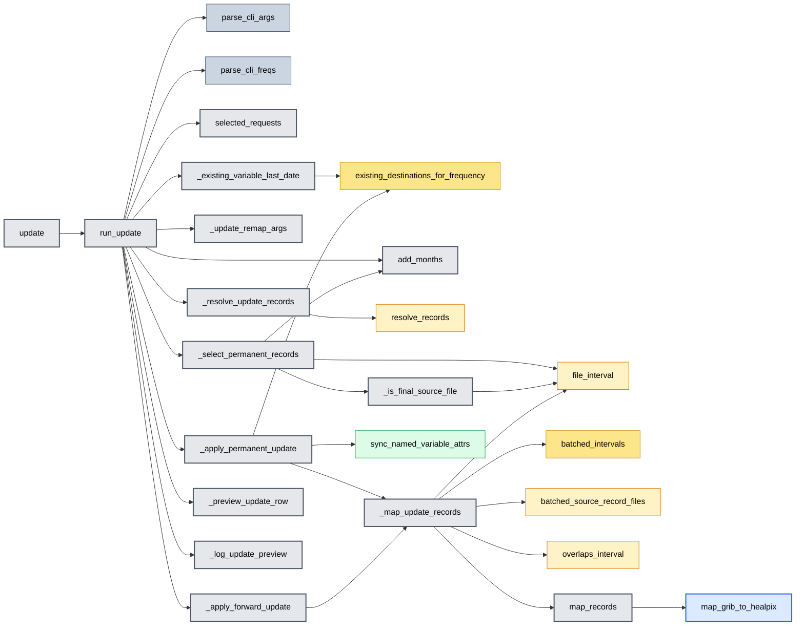

## Clean

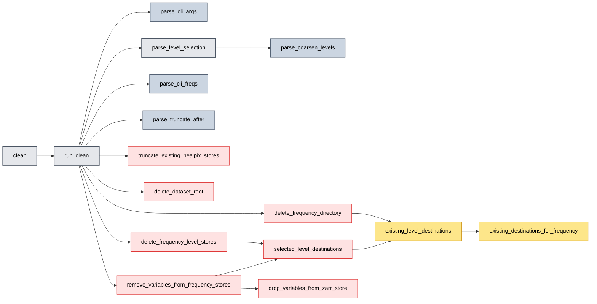

## Merge

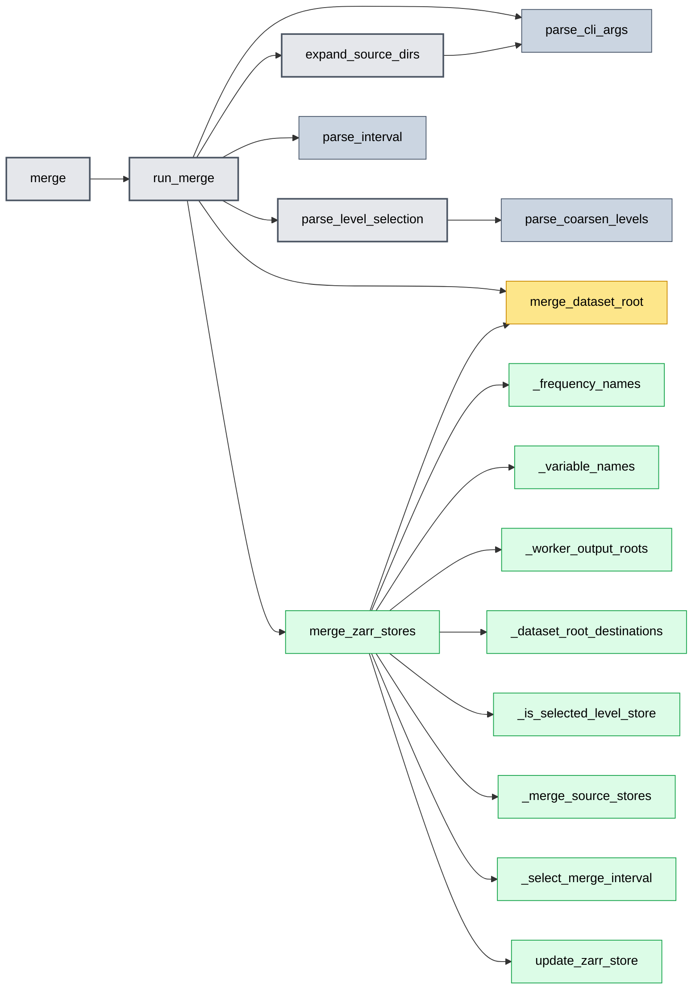

## Reflow

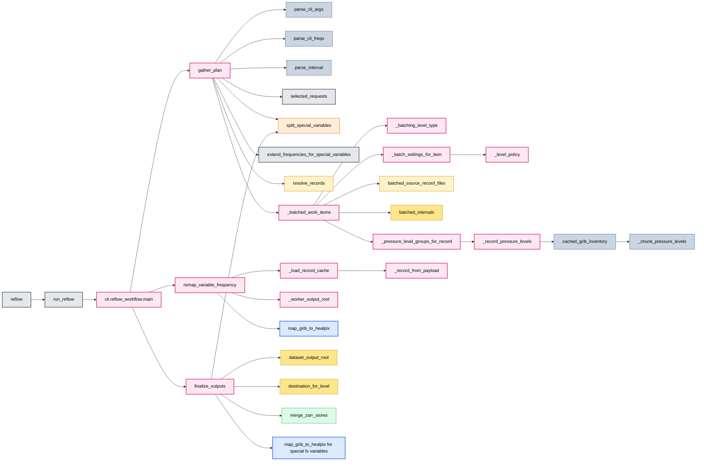

## Redundancy assessment

| Functions | Assessment | Recommended direction |
| --- | --- | --- |
| `cleanup.existing_level_destinations` and `mapper._existing_level_destinations` | Substantively duplicate directory discovery.  Their meaningful difference is return type (`Path` versus `str`). | Keep one shared function, ideally returning `Path`; convert to `str` only at the external API boundary if necessary. |
| `converter.parse_level_selection` and `parse_coarsen_levels` | A pure naming alias. | Remove the alias or rename callers to `parse_coarsen_levels` if command-specific terminology is not valuable. |
| `converter._resolve_update_records` and `resolve_records` | A thin update-specific adapter around the general resolver. | Keep only if it makes update defaults explicit; otherwise inline its small argument adaptation. |
| `converter._update_remap_args` | A thin `argparse.Namespace` adapter for reusing remap logic during update. | Keep as an explicit compatibility boundary; replacing it with an untyped dictionary would be worse. |
| `zarr_publisher.sync_global_attrs` and `_sync_global_attrs` | Public wrapper around private implementation, not duplicated behavior. | Keep; it defines the module's supported API. |
| `_apply_permanent_update` and `_apply_forward_update` | They share `_map_update_records`, but permanent updates also record permanent-update metadata. | Keep separate.  The common mapping helper is already the right extraction. |
| Cleanup deletion helpers | Similar traversal but distinct scopes: variable, selected level, frequency, or dataset root. | Keep separate; consolidating them would blur destructive-operation scope. |
| `run_remap` and reflow workers | Both intentionally converge on `map_grib_to_healpix`. | Keep shared; reflow is orchestration/batching, not a competing mapping implementation. |

## Source map

The most useful starting points are:

- [`converter.py`](converter.py): command dispatch and orchestration.
- [`helpers/mapper.py`](helpers/mapper.py): the main GRIB-to-HEALPix transformation.
- [`helpers/datasets.py`](helpers/datasets.py): opening, normalising, and merging source datasets.
- [`helpers/zarr_publisher.py`](helpers/zarr_publisher.py): append/rewrite publication semantics.
- [`helpers/cleanup.py`](helpers/cleanup.py): truncation and deletion operations.
- [`cli/reflow_workflow.py`](cli/reflow_workflow.py): parallel plan, worker, and finalisation flow.
